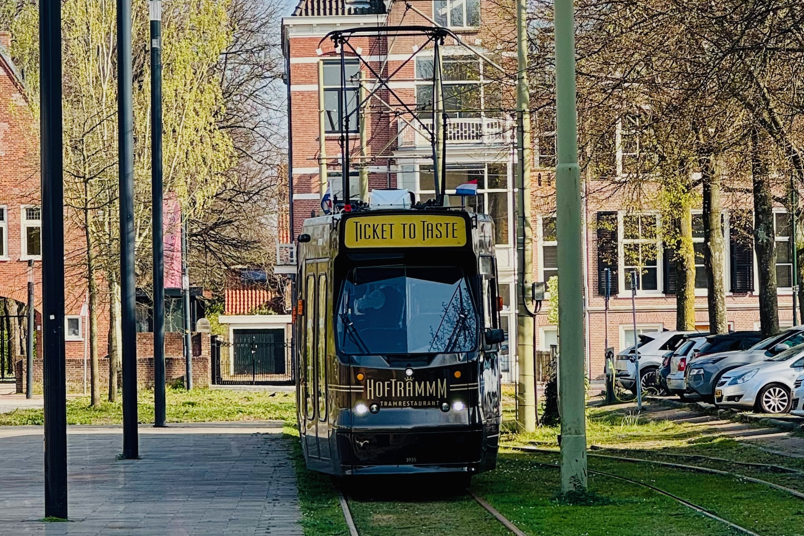

Together with friends,
we had an amazing evening dining at [Hoftrammm Tramrestaurant](https://hoftrammm.nl),
a unique experience that combined the charm of a tram
with the elegance of fine dining.
The restaurant offers a cozy atmosphere
and serves delicious dishes prepared right on board the tram as it travels through The Hague. Our evening was truly memorable!

As the menu changes every couple of months, I saved the one we had this evening:

**Abri:**
On our “Abri” we have a ton-sur-ton of tomato; A baba in syrup, a cake with a tomato cream and a bottle of gazpacho. With that a roll with herb oil and herb salt.

**Welcome**
As a welcome dish we serve a salmon mousse with marinated white cabbage salad and homemade pickle. The dish is garnished with a braided crisp and the (edible) signatures and famous quotes of our own Executive Chef; Pierre Wind and founder of the Hoftrammm; Bobby.

**Starter:**
As a starter we serve a ham-asparagus-roulade with patémousse and a savoury watermelon custard. A trammezini ring and marinated watermelon with bow tie complete the dish.

**Entree:**
As an intermediate course we serve a spring soup Hoftramm style: thinly sliced ​​entrecote filled with a garnish of celeriac and garnished with spring onion.

**Maincourse:**
The main course consists of chicken in a tartlet with “truffleduchphine” (pomme duchesse and dauphine combined), pumpkin, green beans and kohlrabi.

**Dessert:**
The dessert is a combination of chocolate and strawberry and includes a brownie with strawberry cream, yoghurt-strawberry bavarois and a glazed strawberry.

_I am actually writing this on a saturday
as I was not able the write the post after having such a long day
with such good food._
