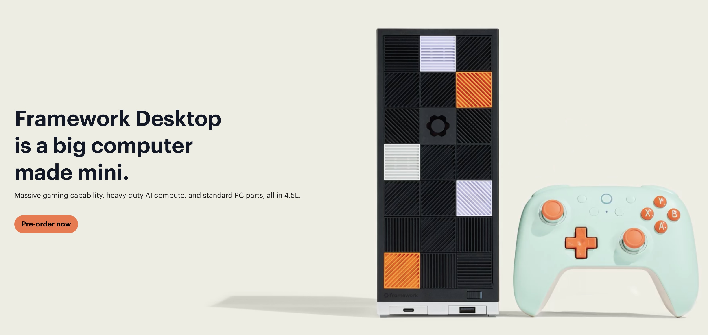

Der [Framework Desktop](https://frame.work/nl/en/desktop) ist ein kompakter Mini-ITX-PC,
der überraschend viel Leistung bietet
und besonders für Nutzer interessant ist,
die sowohl Gaming als auch lokale KI-Aufgaben ausführen wollen.

Innerhalb eines 4,5‑Liter‑Gehäuses kombiniert er einen AMD Ryzen AI Max 395+ APU
mit bis zu 16 Zen 5-Kernen,
40 RDNA 3.5‑iGPU-CUs
und bis zu 128 GB LPDDR5x‑RAM,
was laut Framework für 1440p-Gaming und anspruchsvolle KI-Workloads ausreichen soll.

Der kompakte Formfaktor und das modulare Design zeichnen das Gerät aus.
Trotz seines kleinen Gehäuses bietet er zwei M.2‑Slots für NVMe‑SSDs
sowie Schnittstellen wie USB4,
HDMI,
DisplayPort,
5‑GbE
und Wi‑Fi 7.
Die Frontplatte ist austauschbar
und bietet 21 individuelle Tiles
sowie modulare I/O-Erweiterungen,
was das System leicht anpassbar macht.

Typisch für [Framework](https://frame.work/nl/en/desktop) ist auch der modulare Ansatz:
Das Mainboard lässt sich allein für €929 erwerben
und in ein eigenes Mini‑ITX-Gehäuse integrieren.
Allerdings gibt es zwei zentrale Einschränkungen:
Der RAM ist fest verlötet,
was spätere Upgrades ausschließt,
und es existiert nur ein PCIe‑x4‑Slot,
der keine dedizierte GPU im klassischen Sinne zulässt.

Preislich startet der Desktop bei €1,279,
die Vollversion mit Ryzen AI Max 395+ und 128 GB RAM startet bei  €2,329.
Die ersten Lieferungen sind für Q3 2025 angekündigt,
und mehrere Produktionschargen sind bereits ausverkauft.

Insgesamt bietet der Framework Desktop modulare Anpassbarkeit,
starke integrierte Leistung für Gaming und KI
und ein hochwertiges Gesamtkonzept.
Wer flexible Hardware und Leistung ohne externe GPU sucht
und mit fest verlötetem RAM leben kann,
findet hier ein lohnenswertes System.
