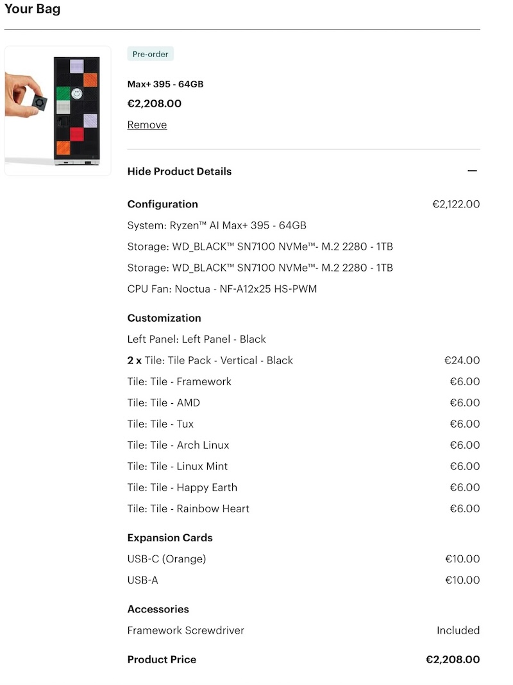

Der Ostersonntag ist für uns auch nur ein Sonntag wie jeder andere.
Abgesehen davon, dass an diesem Sonntag tatsächlich einmal die Sonne scheint.

Mit meiner Passwort-Aufräumaktion bin ich ein gutes Stück weitergekommen.
Es fühlt sich gut an, dort endlich Ordnung zu schaffen.
Ein Nebeneffekt: Ich habe dabei erneut über zehn Accounts löschen lassen.
Es ist wirklich ärgerlich, dass der Registrierungsprozess heutzutage so einfach ist,
während das Deaktivieren und Löschen von Accounts unnötig kompliziert wird.
Für ein oder zwei Accounts musste ich sogar erst einen weiteren Account im zugehörigen Forum erstellen (sigh),
nur um dann darum zu bitten, dass beide Accounts gelöscht werden.
Da fragt man sich doch, warum der Account für die Website nicht auch gleichzeitig für das Forum funktioniert. Seufz!
Ich bezweifele nur, dass sich in Zukunft irgendwas daran ändern wird.

Ich habe festgestellt,
dass immer mehr Leute Hardware von [Framework] (<https://frame.work/nl/en/desktop>) kaufen.
Bisher hat Framework vor allem Laptops verkauft,
aber der neue Desktop-PC sieht echt gut aus.
Unsere Desktop-Computer sind schon etwas älter,
daher spiele ich mit dem Gedanken,
Ende des Jahres oder Anfang des nächsten Jahres einen neuen zu kaufen.

Ich habe mir die Konfiguration mal angeschaut und laut den aktuellen Benchmarks kann der AMD Ryzen AI Max+ 395 es wohl mit CPUs wie einem Ryzen 9 9900X und Grafikkarten der unteren Mittelklasse, wie einer RTX 4050, aufnehmen.
Deshalb kann ich mir vorstellen, dass wir unsere alten Desktop-Rechner gegen Ende des Jahres oder spätestens Anfang 2026 ersetzen.  Ich finde es nicht schlimm, dass er sich nicht sonderlich aufrüsten lässt. Wir haben die alten Rechner, abgesehen von einer größeren Festplatte, auch nicht aufgerüstet.
Die Preise von über 2000 Euro sind aber leider wohl unvermeidlich, wenn du etwas haben willst, das dann wieder sechs bis sieben Jahre lang halten soll.

p.s.: Framework ist eine Firma hier aus den Niederlanden
und alleine deshalb schon einen Blick wert.
