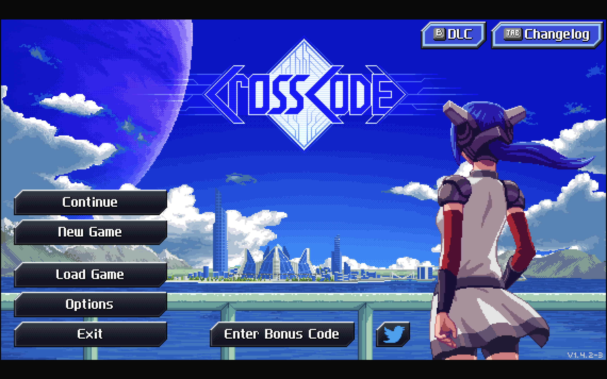

Den Haag:️ ☀️  Sonnig, 🌡️+19°C(+19°C), 🌬️↓16km/h

Gestern ist der Tag irgendwie so schnell vergangen, dass ich gar nicht mehr dazu gekommen bin, meine Gedanken zu sammeln oder noch etwas aufzuschreiben.
Zum einen, weil ich mich am Nachmittag ein bisschen in der Installation und Konfiguration von [Perplexica](https://github.com/ItzCrazyKns/Perplexica) verloren habe.
Und zum anderen, weil ich nach dem eher mittelmäßigen Abendessen einfach keine Lust mehr hatte, noch irgendetwas zu tippen.
Stattdessen habe ich nach langer Zeit mal wieder ein Spiel ausgepackt, das ich vor ein paar Tagen gekauft und bisher nur ganz kurz angespielt hatte.

Als Abendessen haben wir uns beim koreanischen Imbiss Kimchi-Burger bestellt.
Und ganz ehrlich: Dieses vergorene Zeug kommt definitiv auf meine Liste der Speisen, die ich nicht noch einmal bestellen möchte.

Dabei fällt mir ein: Ich sollte wohl auch bald mal meine `/now`-Seite aktualisieren.

### CrossCode

Das Spiel, das ich gestern noch gespielt habe und eigentlich schon wieder beiseite legen wollte, ist [CrossCode](https://www.cross-code.com/).
Ein Indie-RPG, das ich erst vor kurzem für unter 5 Euro ergattert habe.

Erst dachte ich: "Das muss hier mal losgehen!"
– denn die Anfangsgeschichte hat sich gefühlt ein bisschen zu lange hingezogen.
Mag aber auch sein, dass ich beim ersten Anspielen einfach nicht richtig reingekommen bin.
Aber jetzt, nach der ersten Stunde, wird es richtig interessant.
Jetzt, wo es endlich ein Inventar,
einen ziemlich großen Skillbaum,
Quests und sogar einen (freundlichen) Rivalen gibt, macht es echt Spaß.
Und auf so OldSchool Pixelgrafik stehe ich ja sowieso.

Allerdings habe ich nach der Hälfte meiner gestrigen Spielzeit vom Controller auf Tastatur und Maus gewechselt – ich habe einfach nichts getroffen.

## Funstücke der Woche

Ich bin mir auch nicht mehr so sicher, ob ich die Fundstücke noch veröffentlichen soll.
Da ich aktuell noch eine andere Idee habe, wie ich die für mich besser organisieren kann.
Im Bootcamp habe ich gerade das Kapitel über Authentication und Authorization durch.
Mit diesem Wissen könnte ich mir etwas zusammenbauen,
was wie mein alter Blog funktioniert hat,
bzw. etwas bauen ähnlich [Shaarli](https://github.com/shaarli/Shaarli) oder [memos](https://github.com/usememos/memos).
Ich denke, das könnte eine interessante Herausforderung werden.
Mal schauen. Diesen Sonntag gibt es sie aber noch einmal, mal gucken wie es nächste Woche aussieht.
