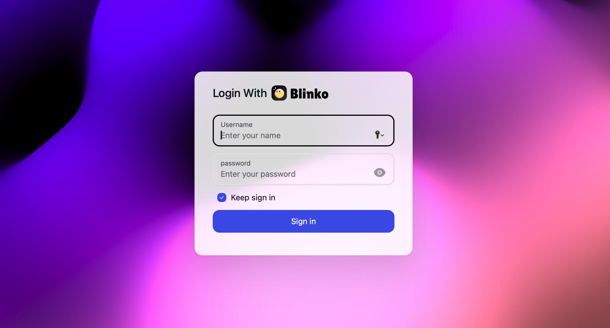

Den Haag:️ ☀️  Sonnig, 🌡️+17°C(+17°C), 🌬️↙14km/h

Heute habe ich das vorletzte Kapitel vom [Bootcamp](https://bootcamp.dev) abgeschlossen
und noch ein bisschen gelernt.
Ich hänge gefühlt etwa eine Woche hinterher,
ein Kapitel und ein Projekt stehen noch aus.
Jetzt kommt das lange Wochenende, und ich hoffe,
dass ich damit etwas aufholen kann.

Als Projekt möchte ich gerne etwas mit [Astro](https://astro.build), Server-Side Rendering (SSR), [Drizzle](https://orm.drizzle.team) als ORM und [BetterAuth](https://betterauth.com) umsetzen.
Da gefühlt alle immer nur irgendwelche Task-Management-Apps bauen,
will ich mal was anderes probieren.

Meine Idee: ein kleiner "Twitter"-Klon.
Nichts weltbewegend Neues, klar – aber ich glaube,
das kann trotzdem spannend werden.
Außerdem kann ich mich wegen des Zeitdrucks gut am [Mega-Flask-Tutorial](https://blog.miguelgrinberg.com/post/the-flask-mega-tutorial-part-i-hello-world) orientieren.
Das spart Zeit bei Planung und Design.

Eigentlich wollte ich mich heute schon an das Projekt setzen,

aber ich wollte unbedingt noch [Blinko](https://blinko.space) ausprobieren. Das klang einfach zu spannend, um es links liegen zu lassen:

> *Blinko is the next generation of open-source AI-powered card notes designed to help you quickly capture and organize inspiration so that ideas never run out.*

Also habe ich mir auf dem NAS in Portainer fix einen neuen Stack eingerichtet
und nach ein bisschen Rumprobieren hat dann auch endlich die Verbindung zu Ollama geklappt.
Jetzt werde ich mich in den nächsten Tagen einfach ein bisschen damit beschäftigen und schauen,
ob sich damit was Nützliches anstellen lässt. Mal sehen, was dabei rauskommt.
