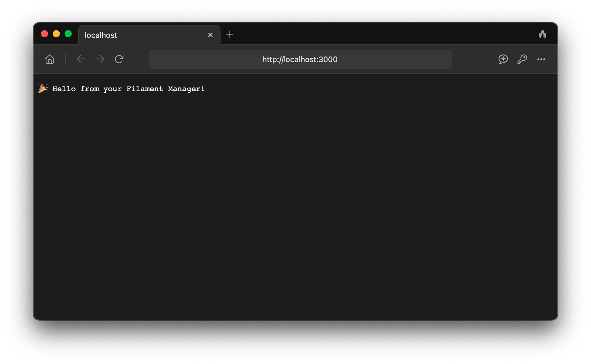
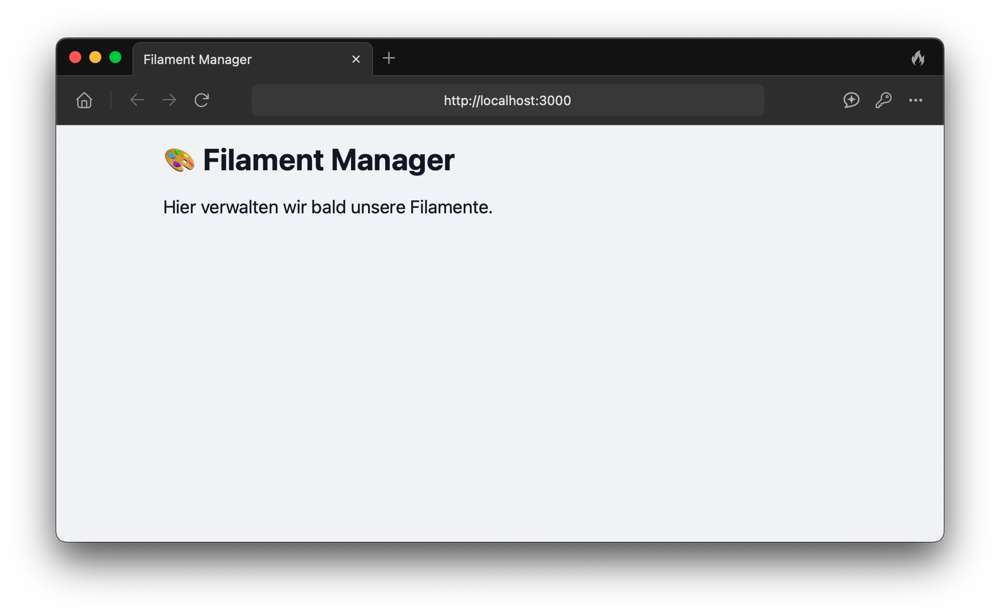

Ich hänge immer noch ein wenig im Bootcamp hinterher.
Da ich die Aufgaben aber nicht schleifen lassen will, habe ich mir gestern einen kleinen Plan aufgestellt,
um mein Projekt zu pushen: Es soll ein einfacher Filament-Manager werden,
mit dem ich meine Spulen und deren Eigenschaften verwalten kann.

Da ich das nicht mit Astro, sondern mit [Bun](https://bun.sh), [Hono](https://hono.dev)
und [TailwindCSS](https://tailwindcss.com) umsetzen möchte, stellte sich die Frage:

**Wie kann ich TailwindCSS in mein Projekt integrieren?**
Für viele Frameworks gibt es entsprechende Plugins – aber für Bun und Hono leider nicht.
Nach langem Suchen und Ausprobieren habe ich aber endlich eine Lösung gefunden!

### Projekt-Setup mit Bun & Hono

Als Erstes legen wir ein `hono`-Projekt mit `bun` an:

```bash
bun create hono@latest my-project
cd my-project
```

Dann erstellen wir eine Startseite, die später unsere Übersicht der Filamente enthalten soll.
Dazu fügen wir den folgenden Code in die Datei `src/routes/index.ts` ein:

```ts
// src/routes/index.ts
import { Hono } from 'hono';

const route = new Hono();

route.get('/', (c) => {
  return c.text('Startseite – später kommt hier die Übersicht der Filamente rein');
});

export default route;
```

Diese Route binden wir anschließend in unsere neue `src/app.ts` ein, um die Hono-App zu initialisieren:

```ts
// src/app.ts
import { Hono } from 'hono';
import indexRoute from './routes/index';

const app = new Hono();

app.route('/', indexRoute);

export default app;
```

Zum Schluss ergänzen wir die Datei `src/index.ts`, welche der Einstiegspunkt für die App ist:

```ts
// src/index.ts
import app from './app';

const port = process.env.PORT || 3000;

console.log(`Server is running on http://localhost:${port}`);
Bun.serve({
  port,
  fetch: app.fetch,
});
```

Mit dem Befehl `bun run dev` starten wir den Server.
Wenn alles funktioniert, ist die Startseite unter `http://localhost:3000` erreichbar.



### TailwindCSS integrieren

Jetzt kümmern wir uns um die Integration von TailwindCSS.

Zuerst installieren wir die nötigen Pakete:

```bash
bun add -D tailwindcss @tailwindcss/cli
```

Dann legen wir im Verzeichnis `/src/styles` eine `global.css`-Datei an – für TailwindCSS und mögliche eigene Styles:

```css
/* src/styles/global.css */
@import "tailwindcss";
```

Da es keine offiziellen Plugins für Bun und Hono gibt, müssen wir die CSS-Datei selbst kompilieren.
Das funktioniert mit folgendem Befehl:

```bash
bunx @tailwindcss/cli -i ./src/styles/global.css -o ./public/output.css --watch
```

> Die Ausgabe landet in `./public/output.css`, und der Watch-Modus bleibt aktiv, bis man ihn mit `Ctrl + C` stoppt.

### HTML-Template einbinden

Da wir jetzt eine `output.css` im `public`-Ordner haben, können wir ein HTML-Template erstellen und in Hono einbinden.

Dazu erstellen wir in `src/templates` eine Datei `layout.tsx`:

```tsx
export const Layout = ({ children }: { children: string }) => {
  return `
    <!DOCTYPE html>
    <html lang="de">
      <head>
        <meta charset="UTF-8" />
        <meta name="viewport" content="width=device-width, initial-scale=1.0" />
        <title>Filament Manager</title>
        <link href="/public/output.css" rel="stylesheet">
      </head>
      <body class="bg-gray-100 text-gray-900 p-4">
        <main class="max-w-2xl mx-auto">
          ${children}
        </main>
      </body>
    </html>
  `;
};
```

Nun passen wir `src/routes/index.ts` an, sodass die Startseite das Template verwendet:

```ts
// src/routes/index.ts
import { Hono } from 'hono';
import { Layout } from '../templates/layout';

const route = new Hono();

route.get('/', (c) => {
  const content = `
    <h1 class="text-3xl font-bold mb-4">🎨 Filament Manager</h1>
    <p class="text-lg">Hier verwalten wir bald unsere Filamente.</p>
  `;
  return c.html(Layout({ children: content }));
});

export default route;
```

Der Text in der `content`-Variable wird an das Template übergeben und dort eingefügt,
wo zuvor `${children}` definiert war.

### Statische Dateien bereitstellen

Damit die `output.css` auch im Browser geladen wird, muss Hono den `/public`-Ordner freigeben.
Das geht mit der `serveStatic`-Middleware:

```ts
app.use('/public/*', serveStatic({ root: './' }));
```

Einfach in `src/app.ts` ergänzen zwischen der Initialisierung der App und dem bisherigen Routing:

```ts
// src/app.ts
import { Hono } from 'hono';
import { serveStatic } from 'hono/bun';
import indexRoute from './routes/index';

const app = new Hono();

// serve static files like /public/output.css
app.use('/public/*', serveStatic({ root: './' }));

app.route('/', indexRoute);

export default app;
```

Im Terminal kann nun der Server mit `bun run dev` gestartet werden.
Wenn alles klappt, sollte die Seite unter `http://localhost:3000` mit TailwindCSS-Styles angezeigt werden.



### Dev-Workflow verbessern

Um nicht ständig zwei Terminals offen haben zu müssen – eines für Hono, eines für Tailwind –,
passe ich meine `package.json` an.

Zwar kann man mit `&`-Operatoren mehrere Befehle verketten,
aber das wird schnell unübersichtlich und fehleranfällig.

Also installieren wir `concurrently`:

```bash
bun add -D concurrently
```

Dann erweitern wir den Eintrag in der `package.json`:

```json
"scripts": {
  "dev": "concurrently \\"bun run --hot src/index.ts\\" \\"bunx @tailwindcss/cli -i ./src/styles/global.css -o ./public/output.css --watch\\""
}
```

Jetzt startet `bun run dev` **beide Prozesse gleichzeitig**.

Wenn man es noch hübscher möchte, kann man sogar Namen und Farben für die Prozesse setzen:

```json
"scripts": {
  "dev": "concurrently --names \\"server,styles\\" --prefix-colors \\"yellow,blue\\" \\"bun run --hot src/index.ts\\" \\"bunx @tailwindcss/cli -i ./src/styles/global.css -o ./public/output.css --watch\\""
}
```

### Fazit

Und das war’s auch schon!
Eigentlich gar nicht so schwer – aber für mich war es eine kleine Herausforderung,
weil ich mit **Bun** und **Hono** noch nicht so vertraut bin.
