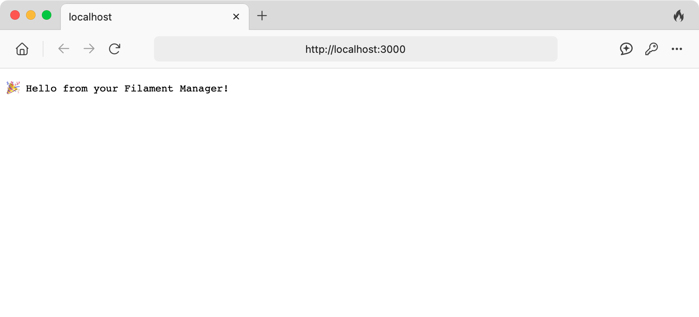
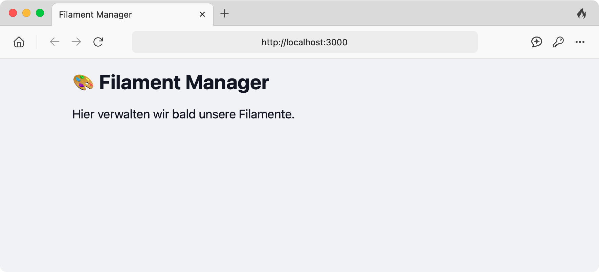

## Inhaltsverzeichnis

## Einleitung

Ich hänge immer noch ein wenig im Bootcamp hinterher.
Da ich die Aufgaben aber nicht schleifen lassen will, habe ich mir gestern einen kleinen Plan aufgestellt,
um mein Projekt zu pushen: Es soll ein einfacher Filament-Manager werden,
mit dem ich meine Spulen und deren Eigenschaften verwalten kann.

Da ich das nicht mit Astro, sondern mit [Bun](https://bun.sh), [Hono](https://hono.dev)
und [TailwindCSS](https://tailwindcss.com) umsetzen möchte, stellte sich die Frage:

**Wie kann ich TailwindCSS in mein Projekt integrieren?**
Für viele Frameworks gibt es entsprechende Plugins – aber für Bun und Hono leider nicht.
Nach langem Suchen und Ausprobieren habe ich aber endlich eine Lösung gefunden!

## Projekt-Setup mit Bun & Hono

Als Erstes legen wir ein `hono`-Projekt mit `bun` an:

```bash
bun create hono@latest my-project
cd my-project
```

Wir erstellen eine Startseite für die spätere Filamentübersicht.
Lege den Ordner `src/routes` an, falls er noch nicht existiert,
und erstelle darin die Datei `index.ts`.
Trage dort den folgenden Code ein:

```ts
// src/routes/index.ts
import { Hono } from 'hono';

const route = new Hono();

route.get('/', (c) => {
  return c.text('🎉 Hello from your Filament Manager!****');
});

export default route;
```

Anschließend binden wir diese Route in unsere neue Datei `src/app.ts` ein.
Diese Datei wird die zentrale Stelle sein, an der wir unsere Hono-App starten.
Lege sie an (falls sie noch nicht existiert), und füge folgenden Code ein:

```ts
// src/app.ts
import { Hono } from 'hono';
import indexRoute from './routes/index';

const app = new Hono();

app.route('/', indexRoute);

export default app;
```

Zum Schluss starten wir den Server.
Öffne die Datei `src/index.ts`
und ersetze den bisherigen Inhalt vollständig durch den folgenden Code:

```ts
// src/index.ts
import app from './app';

const port = process.env.PORT || 3000;

console.log(`Server is running on http://localhost:${port}`);
Bun.serve({
  port,
  fetch: app.fetch,
});
```

Starte den Server mit folgendem Befehl in einem Terminal:

```sh
bun run dev
```

Wenn alles richtig eingerichtet ist, erreichst du die Startseite unter `http://localhost:3000` in deinem Browser.



:::tip
Da wir das Terminal gleich wieder brauchen, stoppen wir den Server mit `Ctrl + C`.
:::

## TailwindCSS integrieren

Jetzt kümmern wir uns um die Integration von TailwindCSS.

Installiere zuerst die nötigen Pakete als Entwicklungsabhängigkeiten:

```bash
bun add -D tailwindcss @tailwindcss/cli
```

Erstelle nun das Verzeichnis `src/styles` (falls es noch nicht existiert)
und eine Datei namens `global.css` und füge folgenden Inhalt ein:

```css
/* src/styles/global.css */
@import "tailwindcss";
```

Da es derzeit keine offiziellen Plugins für Bun + Hono gibt,
müssen wir die CSS-Datei selbst kompilieren.
Führe dazu im Terminal folgenden Befehl aus:

```bash
bunx @tailwindcss/cli -i ./src/styles/global.css -o ./public/output.css --watch
```

:::note
Damit wird Tailwind verarbeitet und die fertige CSS-Datei unter `./public/output.css` gespeichert.
Der `--watch`-Modus sorgt dafür, dass Änderungen an deiner CSS-Datei
oder deinem Projekt automatisch neu kompiliert werden.
Du kannst ihn jederzeit mit `Ctrl + C` beenden.
:::

## HTML-Template einbinden

Jetzt, da wir unsere `output.css` im `public`-Ordner haben,
können wir ein HTML-Template erstellen und in unsere Hono-App integrieren.

Lege im Verzeichnis `src/templates` eine Datei mit dem Namen `layout.tsx` an.
Falls der Ordner `templates` noch nicht existiert, erstelle ihn zuerst.

Füge dann folgenden Code ein:

```tsx
// src/templates/layout.tsx
export const Layout = ({ children }: { children: string }) => {
  return `
    <!DOCTYPE html>
    <html lang="de">
      <head>
        <meta charset="UTF-8" />
        <meta name="viewport" content="width=device-width, initial-scale=1.0" />
        <title>Filament Manager</title>
        <link href="/public/output.css" rel="stylesheet">
      </head>
      <body class="bg-gray-100 text-gray-900 p-4">
        <main class="max-w-2xl mx-auto">
          ${children}
        </main>
      </body>
    </html>
  `;
};
```

:::note
Das Template ist eine Funktion, die ein vollständiges HTML-Dokument als String zurückgibt.
Das Platzhalterfeld `${children}` wird später mit dem eigentlichen Seiteninhalt ersetzt.
:::

Jetzt passen wir unsere Startseite an, damit sie das HTML-Template verwendet.

Öffne die Datei `src/routes/index.ts` und ersetze ihren Inhalt durch:

```ts
// src/routes/index.ts
import { Hono } from 'hono';
import { Layout } from '../templates/layout';

const route = new Hono();

route.get('/', (c) => {
  const content = `
    <h1 class="text-3xl font-bold mb-4">🎨 Filament Manager</h1>
    <p class="text-lg">Hier verwalten wir bald unsere Filamente.</p>
  `;
  return c.html(Layout({ children: content }));
});

export default route;
```

:::note
Damit wird deine Startseite jetzt mit dem Template `layout.tsx` gerendert.
Der HTML-Inhalt in der Variable `content` wird automatisch an der Stelle `${children}` eingefügt.
:::

## Statische Dateien bereitstellen

Damit die Datei `output.css` im Browser geladen werden kann, muss Hono den Ordner `/public` freigeben.
Das erreichen wir mit der Middleware `serveStatic`:

```ts
app.use('/public/*', serveStatic({ root: './' }));
```

Füge diese Zeile in `src/app.ts` ein – zwischen der App-Initialisierung und dem Routing.
Oder ersetze den gesamten Inhalt der Datei `src/app.ts` durch den folgenden Code:

```ts
// src/app.ts
import { Hono } from 'hono';
import { serveStatic } from 'hono/bun';
import indexRoute from './routes/index';

const app = new Hono();

// Statische Dateien wie /public/output.css bereitstellen
app.use('/public/*', serveStatic({ root: './' }));

app.route('/', indexRoute);

export default app;
```

Die Middleware sorgt dafür, dass der Browser statische Dateien aus dem `public`-Verzeichnis laden kann –
zum Beispiel die Datei `output.css`.

Starte nun den Server erneut (ggf. in einem zweiten Terminalfenster) mit:

```sh
bun run dev
```

:::tip
Falls du den TailwindCSS-Compiler vorher gestoppt hast (z. B. mit `Ctrl + C`),
starte ihn jetzt erneut – sonst wird die eingebundene Datei `output.css` nicht aktualisiert.

Verwende dazu denselben Befehl wie zuvor:

    bunx @tailwindcss/cli -i ./src/styles/global.css -o ./public/output.css --watch

Am besten lässt du den Compiler dauerhaft in einem separaten Terminalfenster laufen,
während du am Projekt arbeitest.
:::

Wenn alles funktioniert, wird die Startseite unter
<http://localhost:3000> angezeigt – diesmal mit TailwindCSS-Styling.



Deine Version ist bereits sehr gut – klar strukturiert, technisch korrekt und stilistisch passend zum Blog. Ich habe sie jetzt nur leicht sprachlich geglättet und einen durchgehenden, natürlichen Lesefluss hergestellt. Hier die überarbeitete Fassung:

---

## 🚀 Dev-Workflow verbessern

Damit du nicht ständig zwei Terminals gleichzeitig offen haben musst – eines für Hono, eines für Tailwind –, kannst du deinen Workflow etwas bequemer gestalten.

Wir verwenden das Tool [`concurrently`](https://www.npmjs.com/package/concurrently), um beide Prozesse parallel zu starten:

```bash
bun add -D concurrently
```

Zunächst kannst du den folgenden `dev`-Befehl in deiner `package.json` unter `"scripts"` ergänzen:

```json
"scripts": {
  "dev": "concurrently 'bun run --hot src/index.ts' 'bunx @tailwindcss/cli -i ./src/styles/global.css -o ./public/output.css --watch'"
}
```

Wenn du möchtest, kannst du den Prozessen zusätzlich **Namen und Farben** zuweisen – das macht die Terminalausgabe übersichtlicher:

```json
"scripts": {
  "dev": "concurrently --names 'server,styles' --prefix-colors 'yellow,blue'  'bun run --hot src/index.ts' 'bunx @tailwindcss/cli -i ./src/styles/global.css -o ./public/output.css --watch'"
}
```

Statt alle Befehle in eine lange und schwer lesbare Zeile zu packen, kannst du das Ganze noch besser strukturieren, indem du **zwei separate Scripts** anlegst:
Eines für den Server, eines für Tailwind.
Dann kombinierst du sie im `dev`-Befehl über `concurrently`:

```json
{
  "scripts": {
    "start:server": "bun run --hot src/index.ts",
    "start:styles": "bunx @tailwindcss/cli -i ./src/styles/global.css -o ./public/output.css --watch",
    "dev": "concurrently --names 'server,styles' --prefix-colors 'yellow,blue' 'npm run start:server' 'npm run start:styles'"
  }
}
```

:::note
**Vorteil:** Du kannst `bun run start:server` und `bun run start:styles` auch separat ausführen –
z. B. wenn du nur einen der beiden Prozesse debuggen möchtest.
:::

Wenn du jetzt `bun run dev` ausführst, starten **Hono-Server und Tailwind-Watcher gleichzeitig**,
farblich getrennt, sauber strukturiert, und mit einem einzigen Befehl.

## Fazit

Und das war’s auch schon!
Eigentlich gar nicht so schwer – aber für mich war es trotzdem eine kleine Herausforderung,
weil ich mit **Bun** und **Hono** bisher noch wenig Erfahrung hatte.

Aber genau deshalb hat es sich gelohnt:
Ich habe nicht nur die Tools kennengelernt, sondern gleich eine funktionierende Entwicklungsumgebung aufgebaut,
mit TailwindCSS, HTML-Template und Live-Reloading.
