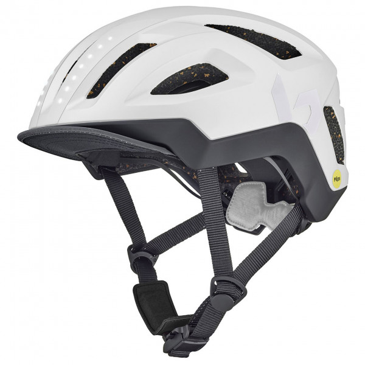

Gestern waren wir mit Freunden im Bowling-Center.
Es war ein sehr schöner Abend
und ich glaube, dass 250 Punkte nach 2 Runden für einen Anfänger schon ganz gut sind.
Wenn man nur ein oder zwei mal im Jahr zum Bowling geht,
dann ist das auch mehr Glück als Können.
Auf jedenfall hatten wir alle eine Menge Spaß.

Dann kam auch die Nachricht,
dass die Lieferung Fahrräder schon für nächste Woche geplant ist.
~~Das ist gut, allerdings haben wir uns noch nicht so richtig für einen Fahrradhelm entschieden.~~
Ich habe nun den [Bollé Halo React Mips](https://www.bolle.com/nl/bike-helmets/bike-helmets/halo-react-mips-88476.html) Helm
in Platinum (weiß) für uns beiden bestellt.
Dieser gefällt uns sehr gut,
hat ein Rücklicht,
ist nicht zu schwer,
hat dieses MIPS (Multi-directional Impact Protection System)
und war dazu noch von 240 Euro auf 80 Euro reduziert.
Was will man mehr?

Nun hoffen wir, dass die beiden Einzelbestellungen auch ankommen. Wahrscheinlich wegen dem reduzierten Angebotspreis,
konnte man nur einen Helm pro Bestellung kaufen.
