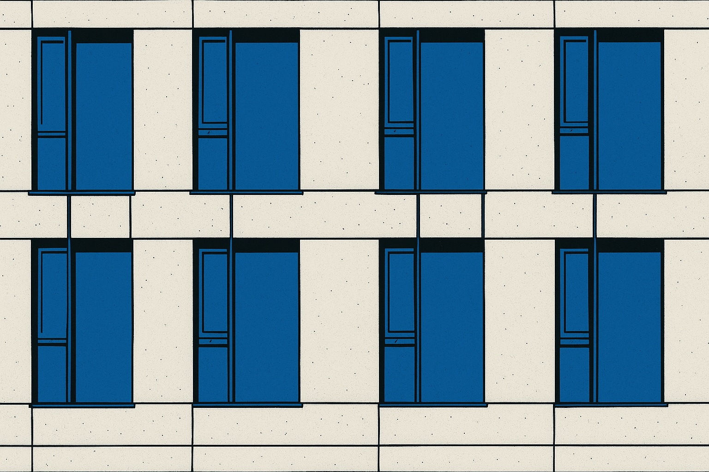

Den Blog habe ich heute überarbeitet
und das ganze dunkle Design komplett verworfen.
Stattdessen ist jetzt alles hell mit blauen Akzenten –
einfach, weil es besser lesbar ist.
Es hat eine Weile gedauert,
bis ich mich entschieden habe,
das so umzubauen,
aber ich bin ehrlich gesagt froh,
dass ich nicht wieder das ganze System
über den Haufen geworfen habe.
Astro gefällt mir wirklich gut,
ich komme damit einfach besser klar
als mit Hugo.

Neben dem Design habe ich auch ein bisschen aufgeräumt.
Einer der alten Blogbeiträge ist jetzt endlich überarbeitet –
da sind ein paar Texte rausgeflogen,
andere habe ich so umgeschrieben,
dass sie mehr Sinn ergeben
und nicht mehr wie ein wild zusammengewürfelter Haufen Notizen wirken.
Das hat mich von Anfang an gestört,
aber jetzt fühlt es sich schon besser an.
Heißt aber auch:
Da wird noch mehr passieren,
ich werde nach und nach weitere Abschnitte überarbeiten
und einiges, was nicht mehr so richtig passt,
einfach in den Microblog verschieben.
An dem arbeite ich allerdings noch.

Ich habe mir auch vorgenommen,
noch alte Beiträge von früher wieder mit aufzunehmen –
aber dazu bin ich bisher noch nicht gekommen.
Wird aber irgendwann passieren.
Bis dahin schraube ich einfach weiter an allem herum.
