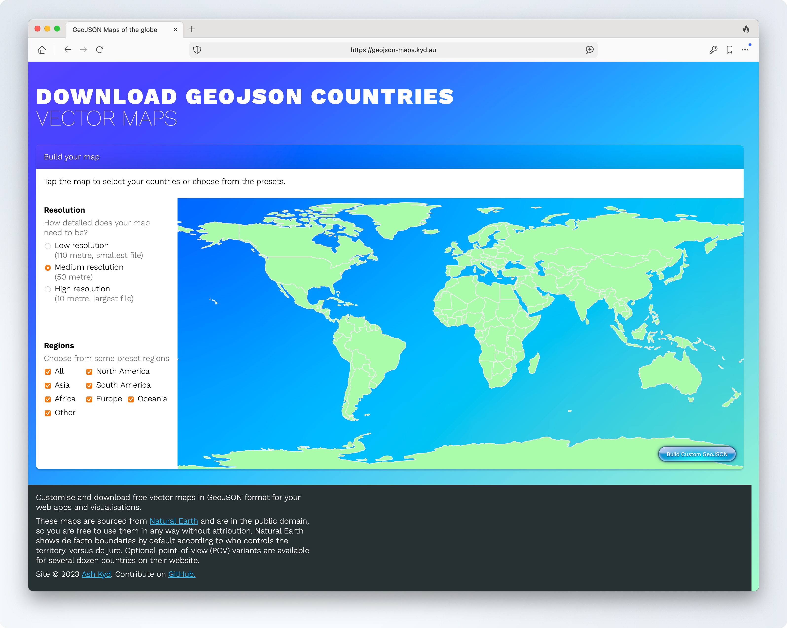
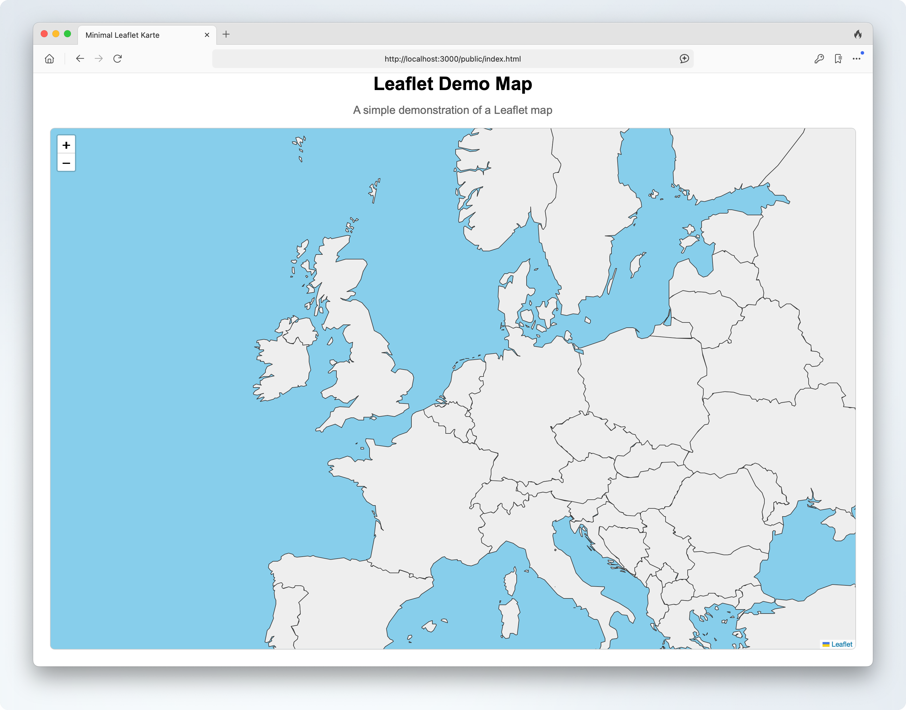
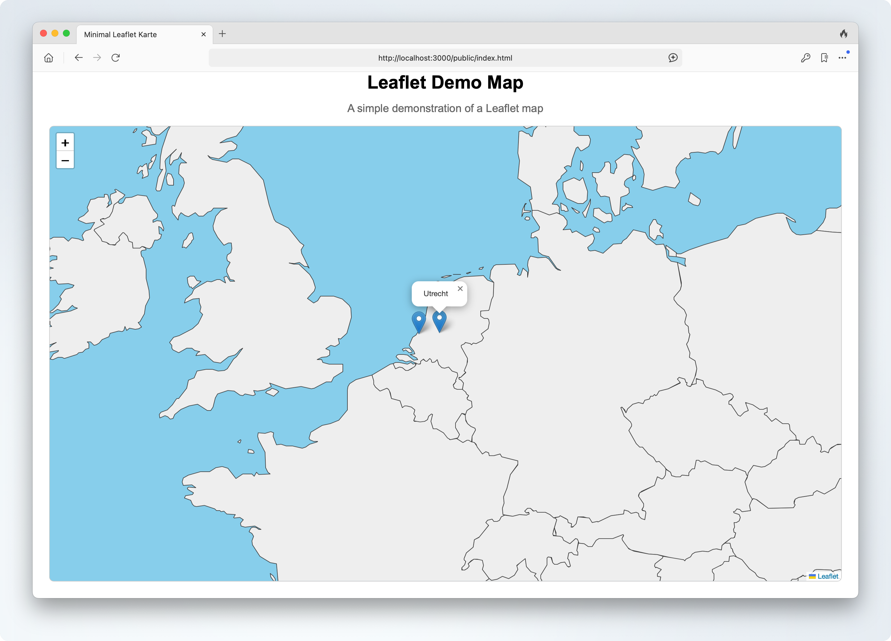
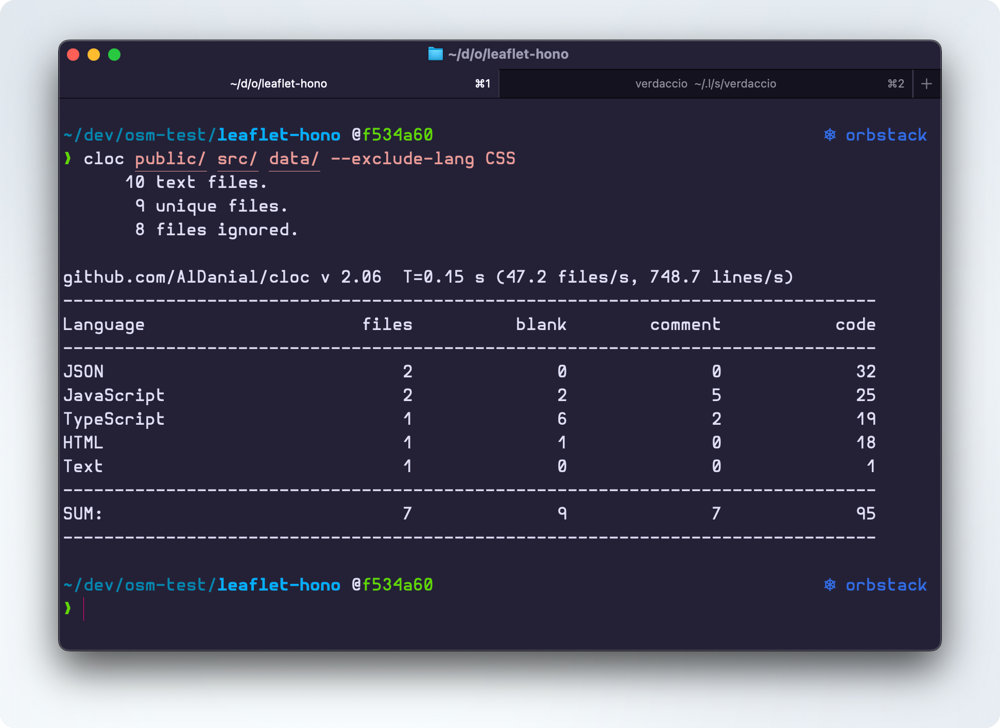

Für ein Projekt benötigte ich eine einfache, offlinefähige [Leaflet](https://leafletjs.com/)-Karte, die nur Ländergrenzen und dynamisch injizierte Punkte anzeigt. Hier ist eine Schritt-für-Schritt-Anleitung, wie du so etwas mit Node.js und [Hono](https://hono.dev) umsetzen kannst.

Hono ist ein leichtgewichtiger Web-Framework für Node.js, das sich hervorragend für einfache APIs eignet.
Wenn wir fertig sind, haben wir eine minimalistische Leaflet-Karte, die offline funktioniert und die Ländergrenzen sowie dynamisch geladene Punkte anzeigt.

## Schritt 1: Projekt initialisieren

Erstelle ein neues Hono-Projekt:

```bash
npm create hono@latest
```

Folge den Anweisungen im Terminal und wähle die folgenden Optionen:

```bash
create-hono version 0.19.2
✔ Target directory leaflet-hono
✔ Which template do you want to use? nodejs
✔ Do you want to install project dependencies? Yes
✔ Which package manager do you want to use? npm
✔ Cloning the template
✔ Installing project dependencies
🎉 Copied project files
Get started with: cd leaflet-hono
```

Wir installieren hier auch Leaflet um aus dem node_modules Verzeichnis auf die Leaflet-Bibliothek zugreifen zu können.

```bash
cd leaflet-hono
npm install leaflet
```

---

## Schritt 2: Projektstruktur anlegen

```
leaflet-hono/
├── data/
├── public/
│   ├── leaflet/
│   │   ├── images/ ( << siehe unten für Details >> )
│   │   ├── leaflet.css
│   │   ├── leaflet.js
│   │   └── leaflet.js.map
├── src/
│   ├── index.ts

```

- **data/** enthält heruntergeladene GeoJSON-Dateien (z. B. Natural Earth 50m).
- **public/** enthält Frontend-Dateien.
- **server.js** enthält den Hono-Server und API-Endpunkte.
- `public/leaflet/images` Ordner mit Leaflet-Bildern aus dem node_modules/leaflet/dist/images Verzeichnis)

Kopiere die Leaflet Dateien aus `node_modules/leaflet/dist/` in den `public/leaflet/` Ordner:

```bash
mkdir -p public/leaflet/images
cp node_modules/leaflet/dist/images/* public/leaflet/images/
cp node_modules/leaflet/dist/leaflet.css public/leaflet/
cp node_modules/leaflet/dist/leaflet.js public/leaflet/
cp node_modules/leaflet/dist/leaflet.js.map public/leaflet/
```

---

## Schritt 3: App starten

Bevor wir weiter machen, stellen wir sicher, dass wir unsere App einmal starten können. Starte dazu den Hono-Server:

```bash
npm run dev
```

Wenn alles richtig eingerichtet ist, solltest du die Standard-Hono-Seite unter **[http://localhost:3000](http://localhost:3000)** sehen.

---

## Schritt 4: `src/index.ts`

Nun erweitern wir die `src/index.ts` Datei, um die Daten aus dem `public` und `data` Ordner bereitzustellen.

```ts
import { serve } from "@hono/node-server";
import { Hono } from "hono";
import { serveStatic } from "@hono/node-server/serve-static";

const app = new Hono();

// Serve static files from 'public'
app.use("/public/*", serveStatic({ root: "./" }));

// Serve static files from 'data'
app.use("/data/*", serveStatic({ root: "./" }));

app.get("/", (c) => {
  return c.text("Hello Hono!");
});

serve(
  {
    fetch: app.fetch,
    port: 3000,
  },
  (info) => {
    console.log(`Server is running on http://localhost:${info.port}`);
  },
);
```

Zum Testen erstellen wir eine einfache Test-Datei, die wir später in der Karte verwenden werden. Erstelle dazu eine Datei `data/poi.geo.json` mit folgendem Inhalt:

```json
{
  "type": "FeatureCollection",
  "features": [
    {
      "type": "Feature",
      "properties": { "name": "Den Haag" },
      "geometry": {
        "type": "Point",
        "coordinates": [4.3007, 52.0705]
      }
    },
    {
      "type": "Feature",
      "properties": { "name": "Utrecht" },
      "geometry": {
        "type": "Point",
        "coordinates": [5.09, 52.0907]
      }
    }
  ]
}
```

Wenn nun `<https://localhost:3000/data/poi.geo.json>` aufgerufen wird, sollte die GeoJSON-Datei angezeigt werden.

---

## Schritt 5: `public/index.html` und `public/styles.css`

In die `index.html` Datei fügen wir die grundlegende Struktur für die Leaflet-Karte ein. Erstelle die Datei `public/index.html` mit folgendem Inhalt:

```html
<!DOCTYPE html>
<html lang="de">
  <head>
    <meta charset="UTF-8" />
    <title>Minimal Leaflet Karte</title>
    <link rel="stylesheet" href="styles.css" />
    <link rel="stylesheet" href="/public/leaflet/leaflet.css" crossorigin="" />
  </head>
  <body>
    <header>
      <h1>Leaflet Demo Map</h1>
      <p class="subtitle">A simple demonstration of a Leaflet map</p>
    </header>

    <div id="map"></div>
    <script src="/public/leaflet/leaflet.js" crossorigin=""></script>
    <script src="map.js"></script>
  </body>
</html>
```

Um das nicht ganz so langweilig zu gestalten, fügen wir noch etwas CSS hinzu. Erstelle die Datei `public/styles.css` mit folgendem Inhalt:

```css
html,
body {
  margin: 0;
  padding: 0;
  width: 100%;
  height: 100%;
}
body {
  font-family: Arial, sans-serif;
  height: 100vh;
  box-sizing: border-box;
  display: flex;
  flex-direction: column;
}

h1,
.subtitle {
  margin: 0 0 0.5em 0;
  text-align: center;
}
.subtitle {
  font-size: 1.2em;
  color: #666;
  margin-bottom: 1em;
}
#map {
  flex: 1;
  margin: 0 2vw 2vw 2vw; /* margin around the map */
  background-color: #f0f0f0;
  border: 1px solid #ccc;
  border-radius: 8px;
}
```

---

## Schritt 6: `public/map.js`

Was nun noch fehlt, ist die Logik, um die Karte zu initialisieren und die GeoJSON-Daten zu laden. Erstelle die Datei `public/map.js` mit folgendem Inhalt:

```js
const map = L.map("map").setView([52.0705, 4.707], 11);

L.tileLayer("https://{s}.tile.openstreetmap.org/{z}/{x}/{y}.png", {
  maxZoom: 19,
}).addTo(map);

fetch("/data/poi.geo.json")
  .then((response) => response.json())
  .then((data) => {
    L.geoJSON(data).addTo(map);
  });
```

Hiermit initialisieren wir die Karte auf den Koordinaten zwischen Den Haag und Utrecht und laden die GeoJSON-Daten von unserem Hono-Server. Die Punkte werden dann als Layer zur Karte hinzugefügt.

Wenn alles geklappt hat, sollte es ungefähr so aussehen:


---

## Schritt 7: OSM ersetzen und Ländergrenzen hinzufügen

Da wir aber eine offlinefähige Karte erstellen wollen, müssen wir die Ländergrenzen und andere Geodaten lokal bereitstellen. Wir verwenden dafür GeoJSON-Dateien von [Natural Earth](https://www.naturalearthdata.com/downloads/50m-cultural-vectors/) die sich gut für kleinere Karten eignen.

Um die Ländergrenzen herunterzuladen, navigiere zu [geojson-maps.kyd.au](https://geojson-maps.kyd.au/), wähle "Medium Resolution" und aktiviere die Checkbox "All". Die mittlere Auflösung ist für unsere Zwecke ausreichend und hat mit nur 4,5 MB eine handhabbare Größe. Die Option "All" stellt sicher, dass alle Ländergrenzen enthalten sind.



Klicke anschließend auf "Build Custom GeoJSON" in der rechten unteren Ecke, um die Datei herunterzuladen. Diese Datei enthält alle Ländergrenzen im GeoJSON-Format, das mit Leaflet kompatibel ist. Speichere die Datei im `data`-Ordner unter dem Namen `vm_medium_countries.geo.json`.

Anschließend erweitern wir die `public/map.js` Datei, um die Ländergrenzen zu laden und anzuzeigen:

```js
const map = L.map("map").setView([52.0705, 4.707], 5);
L.tileLayer("", {}).addTo(map);

fetch("/data/vm_medium_countries.geo.json")
  .then((response) => response.json())
  .then((data) => {
    L.geoJSON(data, {
      style: (feature) => ({
        color: feature.properties.color || "#333",
        weight: 1,
        opacity: 1,
        fillColor: feature.properties.fillColor || "#eee",
        fillOpacity: 1,
      }),
    }).addTo(map);
  });
```

Der Code initialisiert eine Leaflet-Karte ohne Hintergrund-Layer (also ohne Basiskarte) und zeigt die Ländergrenzen aus einer lokalen GeoJSON-Datei an.

- Die Karte wird auf Europa zentriert und auf Zoomstufe 5 gesetzt.
- Es wird ein leerer Tile-Layer hinzugefügt, damit Leaflet korrekt funktioniert, aber keine Online-Kartenkacheln geladen werden.
- Die Ländergrenzen werden per `fetch` aus der Datei `/data/vm_medium_countries.geo.json` geladen.
- Mit `L.geoJSON` werden die Länder als Layer zur Karte hinzugefügt. Die Darstellung (Linienfarbe, Füllfarbe) kann für jedes Land individuell über die Eigenschaften im GeoJSON gesteuert werden (`feature.properties.color` und `feature.properties.fillColor`). Gibt es keine Angabe, werden Standardwerte verwendet.

Um das ganze noch etwas abzurunden können wir die Hintergrundfarbe der Karte in der `public/styles.css` Datei anpassen:

```css
#map {
  flex: 1;
  margin: 0 2vw 2vw 2vw; /* margin around the map */
  background-color: #87ceeb; /* light blue, resembling the sea */
  border: 1px solid #ccc;
  border-radius: 8px;
}
```

Damit erhält die Karte eine hellblaue Hintergrundfarbe, die visuell das Meer andeuten soll. Die Länder werden in einem neutralen Grau dargestellt.



---

## Schritt 8: Ländergrenzen und POI kombinieren

Nun wollen wir noch die POI-Punkte aus der `data/poi.geo.json` Datei auf der Karte anzeigen. Dazu erweitern wir die `public/map.js` Datei:

```js
fetch("/data/poi.geo.json")
  .then((response) => response.json())
  .then((data) => {
    L.geoJSON(data, {
      onEachFeature: (feature, layer) => {
        layer.bindPopup(feature.properties.name);
      },
    }).addTo(map);
  });
```

Nach dem Neuladen der Seite sollten nun die POI-Punkte (Den Haag und Utrecht) auf der Karte angezeigt werden. Wenn du auf einen Punkt klickst, öffnet sich ein Popup mit dem Namen des Ortes.



---

## Bonus: Fancy Leaflet Funktionen

Um die Karte ein wenig interaktiver zu gestalten, können wir noch einige zusätzliche Features hinzufügen. Leaflet bietet viele Möglichkeiten, um die Benutzererfahrung zu verbessern. Ersetze die `public/map.js` Datei mit folgendem Inhalt:

```js
const map = L.map("map").setView([52.0705, 4.707], 6);
// Leaflet benötigt mindestens einen Tile-Layer, auch wenn er leer ist.
// Deshalb wird hier ein leerer Tile-Layer eingebunden, um die Engine korrekt zu initialisieren.
L.tileLayer("", {}).addTo(map);

// Highlight-Funktionen
function highlightFeature(e) {
  const layer = e.target;
  layer.setStyle({
    weight: 2,
    color: "#ff0000",
    fillOpacity: 0.7,
  });
  layer.bringToFront();
}

function resetHighlight(e) {
  geojson.resetStyle(e.target);
}

// Country boundaries with outlines and optional fill
let geojson; // Global variable to hold the geojson layer
fetch("/data/vm_medium_countries.geo.json")
  .then((res) => res.json())
  .then((data) => {
    geojson = L.geoJSON(data, {
      style: (feature) => ({
        color: feature.properties.color || "#333",
        weight: 1,
        opacity: 1,
        fillColor: feature.properties.fillColor || "#eee",
        fillOpacity: 1,
      }),
      onEachFeature: (feature, layer) => {
        layer.bindPopup(feature.properties.name);
        layer.on({
          mouseover: highlightFeature,
          mouseout: resetHighlight,
        });
      },
    }).addTo(map);
  })
  .catch(console.error);

// POI data with popups
fetch("/data/poi.geo.json")
  .then((response) => response.json())
  .then((data) => {
    L.geoJSON(data, {
      onEachFeature: (feature, layer) => {
        layer.bindPopup(feature.properties.name);
      },
    }).addTo(map);
  });
```

Dieser Code fügt folgende Features hinzu:

- **Hover-Effekte**: Länder werden hervorgehoben, wenn der Mauszeiger darüber schwebt.
- **Popups**: Beim Klicken auf Länder oder POI-Punkte öffnet sich ein Popup mit dem Namen.
- **Popup für Länder**: Beim Klicken auf ein Land öffnet sich ein Popup mit dem Namen des Landes.
- **Popup für POI-Punkte**: Beim Klicken auf einen POI-Punkt öffnet sich ein Popup mit dem Namen des Ortes.

---

## 🧭 Fazit



Mit weniger als 100 Zeilen Code lässt sich eine minimalistische, offlinefähige Leaflet-Karte mit Hono realisieren. Ideal für Prototyping oder einfache Anwendungen – ohne externe Abhängigkeiten und voll anpassbar.

Die Karte kann leicht erweitert werden, um weitere Features hinzuzufügen, wie z. B. Marker, Polygone oder andere GeoJSON-Daten. [Leaflet](https://leafletjs.com/) bietet eine Vielzahl von Möglichkeiten, um Karten interaktiv und ansprechend zu gestalten.

Das Projekt in Version 1 kannst du hier herunterladen: [https://codeberg.org/cblte/leaflet-hono-offline/releases/tag/v1](https://codeberg.org/cblte/leaflet-hono-offline/releases/tag/v1)
