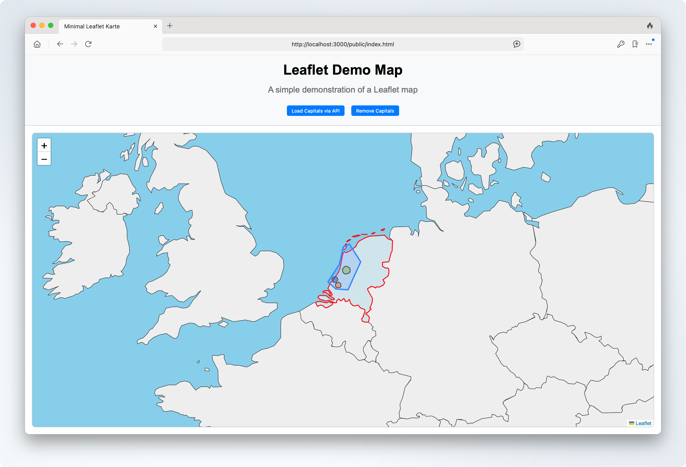

Nach meinem ersten Blogpost zum Leaflet-Hono-Projekt gibt es nun ein Update mit einigen Änderungen und neuen Features.
Hier ein Überblick über die wichtigsten Änderungen:

Statt die Layer-Reihenfolge mit `bringToFront()` zu steuern, haben ich nun Leaflet-Panes benutzt.
So kann ich die Z-Index-Reihenfolge der Layer exakt bestimmen:

- Länder liegen im Pane `countriesPane` (zIndex 400)
- POIs im Pane `poiPane` (zIndex 500)
- Hauptstädte/Capitals im Pane `capitalsPane` (zIndex 600)

Das sorgt für eine saubere und vorhersehbare Darstellung – unabhängig von Interaktionen oder Nachladen von Daten.
Vorallem aber wird bei einem Hover-Over über Länder die Darstellung der POIs nicht mehr beeinflusst.

### Neue map.js Datei

Hier die neue `map.js` Datei, die die Ländergrenzen, POIs und Hauptstädte verwaltet:

```javascript
const map = L.map('map').setView([52.0705, 4.707], 6);
L.tileLayer('', {}).addTo(map);
var capitalsIcon = L.divIcon({ className: 'capitals-icon' });

// Create custom panes for z-order control
map.createPane('countriesPane');
map.getPane('countriesPane').style.zIndex = 400;

map.createPane('poiPane');
map.getPane('poiPane').style.zIndex = 500;

map.createPane('capitalsPane');
map.getPane('capitalsPane').style.zIndex = 600;

// Highlight-Funktionen
function highlightFeature(e) {
  const layer = e.target;
  layer.setStyle({
    weight: 2,
    color: '#ff0000',
    fillOpacity: 0.7,
  });
  layer.bringToFront();
}

function resetHighlight(e) {
  geojson.resetStyle(e.target);
  overlayGroup.bringToFront();
}

// Layer groups for better control
const baseGroup = L.layerGroup().addTo(map);
const overlayGroup = L.layerGroup().addTo(map);
const capitalsLayer = L.layerGroup().addTo(map);

// Country boundaries with outlines and optional fill
let geojson;

// Call layers in correct order
function initLayers() {
  addCountryLayer(addPOILayer);
}

function addCountryLayer(callback) {
  fetch('/data/vm_medium_countries.geo.json')
    .then((res) => res.json())
    .then((data) => {
      if (baseGroup) baseGroup.clearLayers();
      geojson = L.geoJSON(data, {
        pane: 'countriesPane',
        style: (feature) => ({
          color: feature.properties.color || '#333',
          weight: 1,
          opacity: 1,
          fillColor: feature.properties.fillColor || '#eee',
          fillOpacity: 1,
        }),
        onEachFeature: (feature, layer) => {
          layer.bindPopup(feature.properties.name);
          layer.on({
            mouseover: highlightFeature,
            mouseout: resetHighlight,
          });
        },
      }).addTo(baseGroup);
      if (callback) callback();
    })
    .catch(console.error);
}

function addPOILayer() {
  fetch('/data/poi.geo.json')
    .then((response) => response.json())
    .then((data) => {
      if (overlayGroup) overlayGroup.clearLayers();
      L.geoJSON(data, {
        pane: 'poiPane',
        style: function (feature) {
          if (!feature.properties) return {};
          return {
            color: feature.properties.stroke || '#3388ff',
            weight: feature.properties['stroke-width'] || 3,
            opacity: feature.properties['stroke-opacity'] || 1,
            fillColor: feature.properties.fill || '#3388ff',
            fillOpacity: feature.properties['fill-opacity'] || 0.2,
          };
        },
        onEachFeature: (feature, layer) => {
          if (feature.properties && feature.properties.name) {
            layer.bindPopup(feature.properties.name);
          }
        },
      }).addTo(overlayGroup);
    });
}

// Capitals logic
function clearCapitals() {
  capitalsLayer.clearLayers();
}

document.getElementById('capitals-btn').onclick = async function () {
  clearCapitals();
  const res = await fetch('/api/capitals');
  const capitals = await res.json();
  capitals.forEach((capital) => {
    const marker = L.marker([capital.lat, capital.lng], { icon: capitalsIcon, pane: 'capitalsPane' }).bindPopup(capital.name);
    capitalsLayer.addLayer(marker);
  });
  capitalsLayer.bringToFront();
};

document.getElementById('remove-capitals-btn').onclick = function () {
  clearCapitals();
};

initLayers();
```

Die Layer für Länder, POIs und Hauptstädte werden jetzt in eigenen LayerGroups verwaltet. Das macht das Nachladen, Entfernen und Aktualisieren von Daten viel einfacher und übersichtlicher.

### Neue HTML-Struktur

Hier die neue `index.html` Datei, die die Karte und die Buttons enthält:

```html
<!DOCTYPE html>
<html lang="de">
  <head>
    <meta charset="UTF-8" />
    <title>Minimal Leaflet Karte</title>
    <link rel="stylesheet" href="styles.css" />
    <link rel="stylesheet" href="/public/leaflet/leaflet.css" crossorigin="" />
  </head>
  <body>
    <header>
      <h1>Leaflet Demo Map</h1>
      <p class="subtitle">A simple demonstration of a Leaflet map</p>
      <button id="capitals-btn">Load Capitals via API</button>
      <button id="remove-capitals-btn">Remove Capitals</button>
    </header>

    <div id="map"></div>
    <script src="/public/leaflet/leaflet.js" crossorigin=""></script>
    <script src="map.js"></script>
  </body>
</html>
```

### Neue Styles

Dazu passend die neuen Styles in der `styles.css` Datei, für die Karte und die Buttons:

```css
/* Header ersetzen */
header {
  background-color: #f8f9fa;
  padding: 1em;
  text-align: center;
  border-bottom: 1px solid #ccc;
}

/* und in der Map die Werte für 'margin' neu setzen */
#map {
  margin: 1rem 1rem;
}

button {
  padding: 0.5em 1em;
  margin: 0.5em;
  border: none;
  border-radius: 4px;
  background-color: #007bff;
  color: white;
  cursor: pointer;
}

.capitals-icon {
  background-color: #007bff;
  border-radius: 50%;
  width: 24px;
  height: 24px;
  display: flex;
  align-items: center;
  justify-content: center;
}
```

### Neue index.ts Datei

Jetzt noch die `index.ts` Datei, die die API für die Hauptstädte bereitstellt:

```typescript
import { serve } from '@hono/node-server';
import { Hono } from 'hono';
import { serveStatic } from '@hono/node-server/serve-static';

const app = new Hono();

// Serve static files from 'public'
app.use('/public/*', serveStatic({ root: './' }));

// Serve static files from 'data'
app.use('/data/*', serveStatic({ root: './' }));

// API endpoint for dynamic location data
app.get('/api/capitals', (c) => {
  const capitals = [
    { id: 1, name: 'Berlin', lat: 52.52, lng: 13.405 },
    { id: 2, name: 'Paris', lat: 48.8566, lng: 2.3522 },
    { id: 3, name: 'London', lat: 51.5074, lng: -0.1278 },
    { id: 4, name: 'Madrid', lat: 40.4168, lng: -3.7038 },
    { id: 5, name: 'Rome', lat: 41.9028, lng: 12.4964 },
    { id: 6, name: 'Vienna', lat: 48.2082, lng: 16.3738 },
    { id: 7, name: 'Amsterdam', lat: 52.3676, lng: 4.9041 },
    { id: 8, name: 'Brussels', lat: 50.8503, lng: 4.3517 },
    { id: 9, name: 'Copenhagen', lat: 55.6761, lng: 12.5683 },
    { id: 10, name: 'Stockholm', lat: 59.3293, lng: 18.0686 },
    { id: 11, name: 'Oslo', lat: 59.9139, lng: 10.7522 },
    { id: 12, name: 'Helsinki', lat: 60.1695, lng: 24.9354 },
    { id: 13, name: 'Lisbon', lat: 38.7223, lng: -9.1393 },
    { id: 14, name: 'Dublin', lat: 53.3498, lng: -6.2603 },
    { id: 15, name: 'Warsaw', lat: 52.2297, lng: 21.0122 },
    { id: 16, name: 'Prague', lat: 50.0755, lng: 14.4378 },
    { id: 17, name: 'Budapest', lat: 47.4979, lng: 19.0402 },
    { id: 18, name: 'Bratislava', lat: 48.1482, lng: 17.1067 },
    { id: 19, name: 'Ljubljana', lat: 46.0569, lng: 14.5051 },
    { id: 20, name: 'Zagreb', lat: 45.815, lng: 15.9819 },
  ];
  return c.json(capitals);
});

// Redirect root to public/index.html
app.get('/', (c) => c.html('<script>location.href="/public/index.html"</script>'));

// Start the server
serve(
  {
    fetch: app.fetch,
    port: 3000,
  },
  (info) => {
    console.log(`Server is running on http://localhost:${info.port}`);
  }
);
```

Die API liefert eine Liste von Hauptstädten mit ihren Koordinaten. Diese werden später in der Karte als Marker angezeigt. Und mit den neu hinzugefügten Buttons kann der Nutzer die Hauptstädte dynamisch laden und entfernen.

### Neue Daten

Und ins Verzeichnis `data` kommt neben der GeoJSON-Datei `vm_medium_countries.geo.json`, die du von [geojson-maps.kyd.au](https://geojson-maps.kyd.au/) heruntergeladen hast, die neue Version der [`poi.geo.json](./poi.geo.json) Datei welche neue POI enthält.

Wie in der `map.js` Datei zu sehen ist, werden die Information zur Darstellung der POIs jetzt direkt aus den GeoJSON-Properties (`stroke`, `stroke-width`, `fill`, etc.) übernommen. So kann jeder POI individuell gestaltet werden – z.B. für besondere Städte oder Flächen.

## Fazit

Durch die Nutzung von LayerGroups, Panes und klaren Funktionsaufrufen ist der Code jetzt deutlich modularer und leichter zu erweitern.

Wenn alles geklappt hat, solltest du nun eine funktionierende Leaflet-Karte haben, die Ländergrenzen anzeigt und dynamisch POIs und Hauptstädte laden kann und ungefähr so aussieht:


