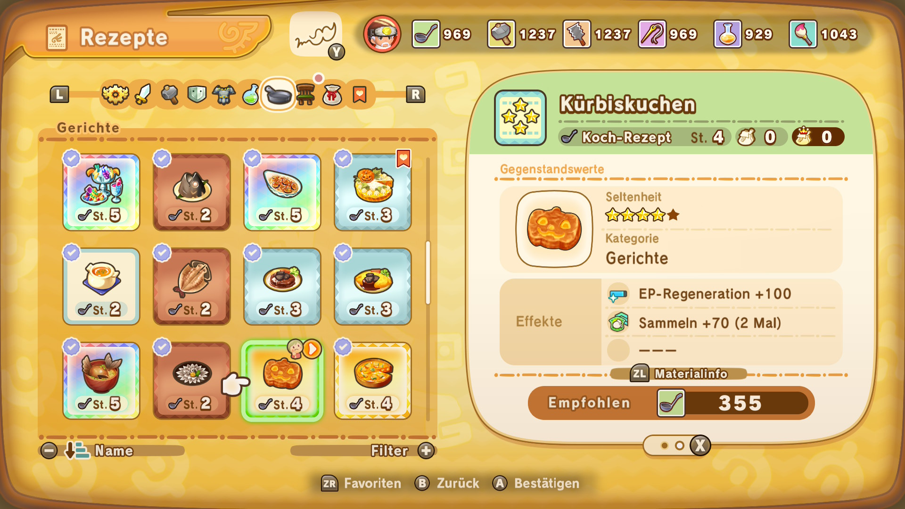
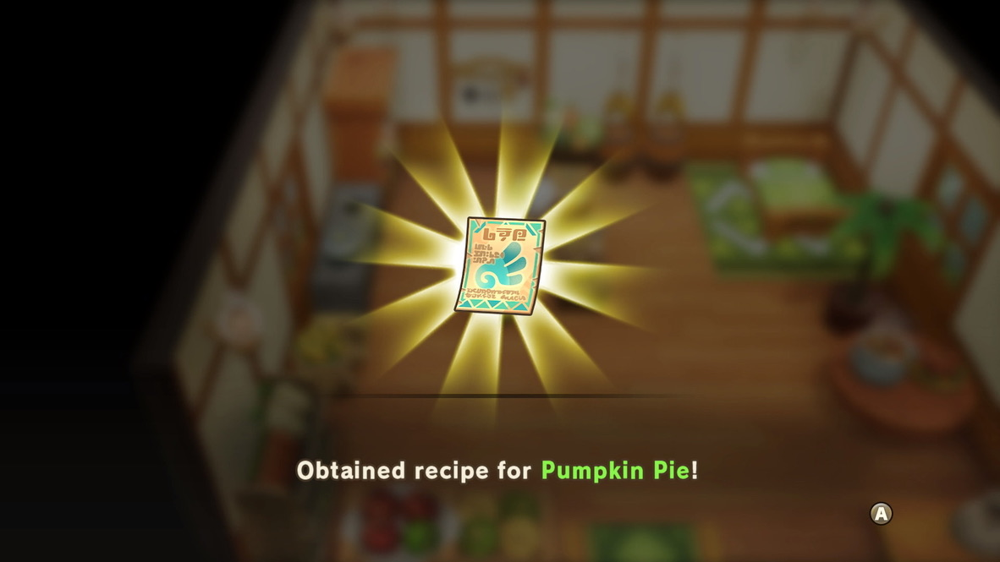

In Fantasy Life i gibt es bestimmte Rezepte, die ausschließlich von bestimmten Charakteren – den sogenannten Ulklingen – vergeben werden. Der Kürbiskuchen ist eines davon.

Um diese Rezepte zu erhalten, muss man mit einem Charakter interagieren, während dieser an seiner Werkbank in seinem Haus steht.

Damit der Ulkling überhaupt ein Haus hat, muss man ihm vorher in der Gilde eines zuweisen. Danach besucht man ihn und spricht ihn an, woraufhin er freudig erzählt, wie schön es ist, nun ein eigenes Zuhause zu haben. Ab diesem Zeitpunkt sollte man alle weiteren Interaktionen mit diesem Charakter unterlassen. Stattdessen legt man sich einfach ins Bett im Haus und schläft bis zum nächsten Morgen. Das wiederholt man so lange, bis der Charakter an seiner Werkbank steht. In dem Moment steht man auf und speichert das Spiel.

Jetzt geht man zur Werkbank und spricht den Ulkling an. Er wird einem erzählen, dass er gerade an einem neuen Rezept arbeitet – und dass man es doch selbst einmal ausprobieren solle. Daraufhin erscheint das Rezept. Wenn es das gewünschte ist, freut man sich und kann man das Haus verlassen. Wenn nicht, sollte man auf keinen Fall das Haus verlassen! Stattdessen öffnet man das Menü und verlässt das Abenteuer über den Menüpunkt "Titelbildschirm", um zum Titelbildschirm zurückzukehren und nicht zu speichern.

Beim nächsten Spielstart befindet man sich wieder vor dem Ulkling an der Werkbank – bereit für einen neuen Versuch. Diesen Vorgang wiederholt man so lange, bis man das gewünschte Rezept erhält.

In meinem Fall habe ich verzweifelt nach dem Rezept für den Kürbiskuchen (Pumpkin Pie) gesucht. Nach acht Nächten stand Chakpo, der Koch, endlich an seiner Werkbank – und ich brauchte noch rund 20 Versuche, bis ich das Kürbiskuchen-Rezept bekam. Mit jedem neuen Rezept, das man erhält, wird der Pool kleiner – was bedeutet, dass die Wahrscheinlichkeit für das nächste Wunschrezept steigt.

Da man nur ein Rezept pro echtem Kalendertag bekommen kann, dauert es eine ganze Weile, bis man alle Rezepte gesammelt hat. Wer möchte, kann die Systemzeit der Konsole oder des PCs ändern, um schneller voranzukommen. Natürlich muss man jedes Mal erneut schlafen, bis der Ulkling wieder an seiner Werkbank steht. Das Ganze ist also ziemlich aufwendig – aber es kann sich lohnen. Und bis der DLC erscheint, ist ja noch etwas Zeit.

Hier ist eine Liste aller Rezepte von den Ulklingen in Englisch:

### Rezepte vom Koch

- Ancient Sashimi Set (Fossiles Sashimi)
- Bagna Càuda (Bagna Cauda)
- Bandit Steak (Banditen-Steak)
- Boiled Veggies (Gekochtes Gemüse)
- Cabbage Rolls (Kohlrouladen)
- Creamy Curry (Tropencurry)
- Deep-Fried Fish (Fisch-Tempura)
- Fancy Sashimi Set (Legendäres Sashimi)
- Flying Sashimi Set (Oasen-Sashimi)
- Forest Quiche (Wald-Quiche)
- Golden Apple Pie (Goldener Apfelkuchen)
- Golden Fish Head (Goldener Fischkopf)
- Lively Oden Stew (Belebender Oden)
- Mountaineer's Stew (Gebirtgseintopf)
- Onion Soup (Zwiebelsuppe)
- Pumpkin Flan (Kürbispudding)
- Pumpkin Pie (Kürbiskuchen)
- Queen's Omelet (Regentinnen-Omelett)
- Rainbow Paella (Regenbogen-Paelle)
- Rainbow Trout Meunière (Regenbogenteller)
- Royal Flan (Königspudding)
- Sardine Pâté (Sardinenpastete)
- Sashimi Set (Sashimi)
- Swordfish Head (Schwertfischkopf)
- Swordfish Meunière (Schwertfischteller)
- Vegetable Stew (Gemüsetopf)
- Wheat Juice (Weizensaft)

### Rezepte vom Schmied

- Dragonslayer's Armor
- Dragonslayer's Gauntlets
- Dragonslayer's Boots
- Carpenter's Tools
- Swordfighter's Barrel
- Lancer's Barrel

### Rezepte vom Schreiner

- Long Stone Countertop
- Fishing Rod Rack
- Wooden Watering Can
- Wooden Bucket
- Log Flower Box
- Knife and Cutting Board
- Round Wooden Chair
- Wooden Side Table
- Tea Table
- Sawing Table
- Hat Hook
- Tool Hook
- Big Fishing Hook
- Fishing Net
- Stacked Crates
- Woodcutter's Stump
- Guitar
- Fish Trap

### Rezepte vom Schneider

- Corsage
- Dragonslayer's Cape
- Royal Pomme Barrette
- Royal Pomme Clothes
- Royal Pomme Gloves
- Royal Pomme Boots
- Dark Sultan's Outfit
- Dark Sultan's Bangles
- Dark Sultan's Boots
- Sealing Robe
- Sealing Boots
- Merc Idol's Beret
- Merc Idol's Dress
- Merc Idol's Gloves
- Merc Idol's Boots
- Light Blue Tapestry
- Cute Rug
- Spiral Mat
- Straw Rug
- Flowery Rug
- Soft Rush Rug
- Fish-for-Life Flag
- Swordfish Tapestry
- Pirate Princess Hat
- Pirate Princess Dress
- Pirate Princess Gloves
- Pirate Princess Boots

### Rezepte vom Alchemisten

- Angler's Goggles
- Anti-Freeze
- Burn-Be-Gone
- Charge Up Aid
- Courtship Fireworks
- Crit Aid
- Daredevil Aid
- De-Paralyzer
- Detoxifier
- Fireworks
- Love Bomb
- Paralyzing Bomb
- Plum Blossom Fireworks
- Poison Bomb
- Sansevieria Plant
- Sealing Spray

### Rezepte vom Künstler

- Freshly Picked Wreath
- Green Spooky Lamp
- Ikebana
- Pink Flower Vase
- Potted Coconut
- Royal Family Portrait
- Swordfish Skeleton

### Credits

Ein großer Dank geht raus die Leute vom Fantasy LIfe Discord die dabei geholfen haben, diese Listen zu erstellen. Danke.
