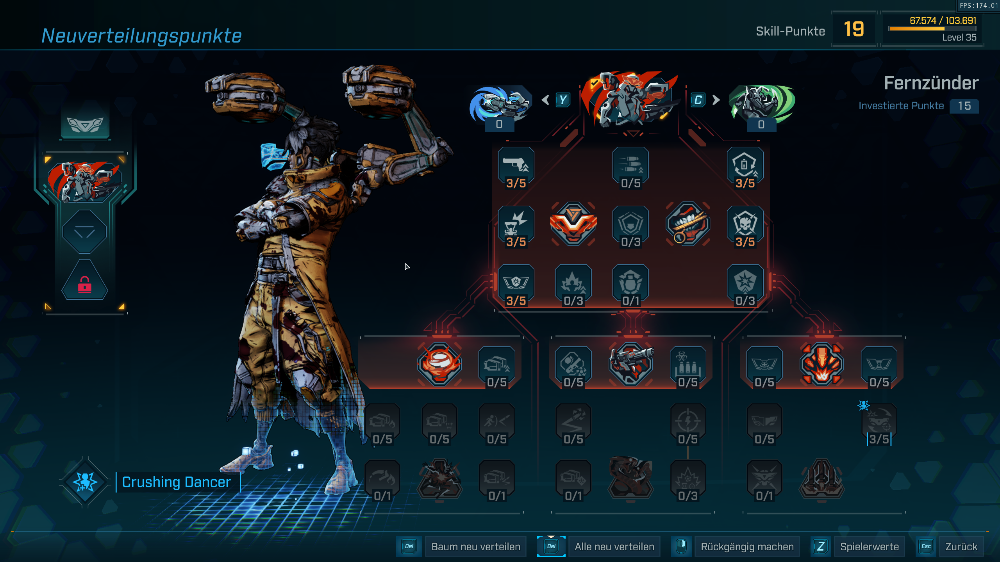
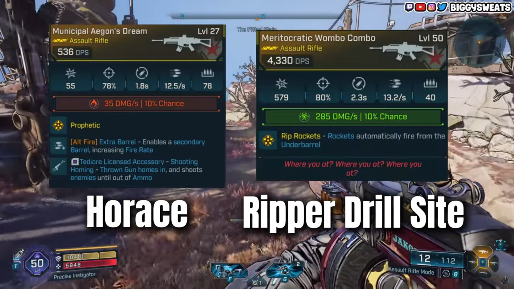

Dieser Build verwandelt **Rafa** sich in eine laufende Artillerieplattform.
Mit dem **Roten Skillbaum (Fernzünder)** zerlegst du Gegner,
Badasses und Bosse mit Dauer-DPS, Raketen-Salven und fast unendlicher Munition.
Perfekt zum Leveln von **1 bis 50** – pure Power ohne Pausen.

## Was dich in diesem Guide erwartet

- ✅ Vollständiger Leveling-Pfad von 1 bis 50
- ✅ Waffensynergien (Vladof-AR + legendäre Ziele)
- ✅ Beste Schilde, Mods & Ordnance-Optionen
- ✅ Tipps für unendliche Munition mit *Kugel-Kumpel Deluxe*
- ✅ Häufige Anfängerfehler – und wie du sie vermeidest
- ✅ Einfacher, aber effektiver Gameplay-Loop

## Warum dieser Build so stark ist

- **Massiver Schaden:** Peacebreaker-Kanonen + Vladof-Sturmgewehre liefern konstanten DPS ohne Downtime.
- **Hohe Überlebensfähigkeit:** Schild-Regeneration + Overdrive-Buff halten dich dauerhaft im Kampf.
- **Unendliche Munition:** Mit *Kugel-Kumpel Deluxe* kannst du Bosse schmelzen, ohne je nachzuladen.
- **Flächenschaden:** Der Capstone *Flüchtige Hohlpunkte* verwandelt Kanonen in Mini-Raketenwerfer.
- **Vorteile:** Enormer Schaden auf allen Distanzen, starkes Crowd-Control, funktioniert solo & im Co-op.
- **Nachteile:** Munitionshungrig außerhalb von *Kugel-Kumpel Deluxe*, abhängig von Overdrive-Uptime.

## Skill-Pfad (Level 1 – 50)

Ein klarer Weg, der DPS, Überleben und Overdrive-Power Schritt für Schritt steigert.

### Frühes Spiel (Level 1 – 15)

Fokus: **Grund-DPS und Schild-Regen**

- **2–4:** *Gut in Schuss* – erhöht Basis-Waffenschaden
- **5–7:** *Schildbarriere* – stärkere Regeneration in Kämpfen
- **8–10:** *MfG!* – Notfall-Schild-Reparatur
- **11–13:** *Läuft!* – verlängert Action-Skill-Dauer
- **14–16:** *Resiliencia* – Schadensreduktion während Overdrive

### Mittleres Spiel (Level 16 – 38)

Fokus: **Overdrive-Power + Capstone rush**

- **17–21:** *Everdrive* (max) – erhöht Fire Rate in Overdrive
- **22–26:** *Tollkühn* (max) – skalierende Schadens-Buffs
- **27–29:** *Doppeldrive* – mehr Mobilität
- **30–33:** *MfG!* + *Schildbarriere* weiter ausbauen
- **34–35:** *Resiliencia* – maximieren
- **36–38:** *Unbekümmert* – + Crit-Damage

### Spätes Spiel (Level 39 – 50)

Fokus: **Blauer Baum (Extrovertiert)** – für Sustain & Munition

- **41–43:** *Nervenkitzel* – mehr Fire Rate in Overdrive
- **44–45:** *Volle Dröhnung* – Munition & DPS-Regen
- **39–40:** weiter in *Unbekümmert* (Roter Baum)
- **46–48:** *Nervenkitzel* (max)
- **49–50:** *Volle Dröhnung* (max) – das Bindeglied für DPS, Sustain & AoE

Am Ende steht ein Rafa, der allein Armeen zerlegt.

## Gameplay-Loop

- **Start:** Friedensbrecher-Kanonen zünden → Overdrive bufft Speed, Fire Rate & Sustain
- **Bewegung:** Immer in Bewegung bleiben – Strafing statt Campen
- **Damage-Loop:** Vladof-Sturmgewehr "entladen" → Kanonen feuern mit
- **Munition:** *Kugel-Kumpel Deluxe* bei Bossen aktivieren
- **Defensive:** *Schildbarriere*, *Läuft!* und *MfG!* halten dich am Leben
- **Rotation:** Action-Skill regelmäßig neu starten – DPS-Phasen & Regen abwechseln

## Beste Ausrüstung

### Waffen

- **Vladof-ARs:** hohe Fire Rate + große Magazine – perfekte Synergie mit Kanonen
- **Legendäre Drops:**
  - *Aegons Dream* (von Horus in Hungering Plains) – präzise, skalierender Schaden
  - *Wombo Combo* (von Ripper Roads in Source Clench) – explosive DPS

### Schilde & Repkit

- **Schilde:** Fokus auf hohe Kapazität + Regen.
  → *Feuerwerks-Schild* (von Splash Zone in Faze Fields) – erzeugt Homing-Missiles bei Kills.
- **Repkit:** *Glänzende Kriegsbemalung* (Legendär) – + 30 % Fire Rate, + 30 % Speed, reduziert Cooldown.

> **Kombination:** Feuerwerks + Kriegsbemalung = endlose Raketen & hoher Tempo-Sustain.

### Ordnance & Mods

- **Transmitter-Ordnance:** Wirft Turret, das mitfeuert – ideal für AR-Builds
- **Class Mods:**
  - *Anstifter* – doppelter Gun-Damage bei vollem Stack
  - *Tänzer* – boostet Overdrive-Effekte für Burst-Phasen

## Häufige Anfängerfehler

1. **Action-Skill zu selten nutzen**
   → *Fix:* Spam ihn – Overdrive hat kurzen Cooldown.
2. **Falsche Schilde verwenden**
   → *Fix:* Priorisiere Kapazität + Regen, bis du *Feuerwerks* bekommst.
3. **Kugel-Kumpel Deluxe verschwenden**
   → *Fix:* Für Bosse oder Badasses aufheben.
4. **Munition vergessen**
   → *Fix:* SDU-Upgrades + *Volle Dröhnung* – AR-Nachschub sichern.
5. **Zu defensiv spielen**
   → *Fix:* Rafa lebt von Aggression. Druck aufrechterhalten, nicht campen.

## Fazit

Der **Fernzünder-Rafa** ist der stärkste Leveling-Build in Borderlands 4.
Mit *Flüchtigen Hohlpunkten*, *Kugel-Kumpel Deluxe* und Vladof-Synergien* wird Rafa zum begehbaren Raketenwerfer – von Level 1 bis 50 und darüber hinaus.

> Probier ihn aus, experimentiere mit Waffenvarianten!
